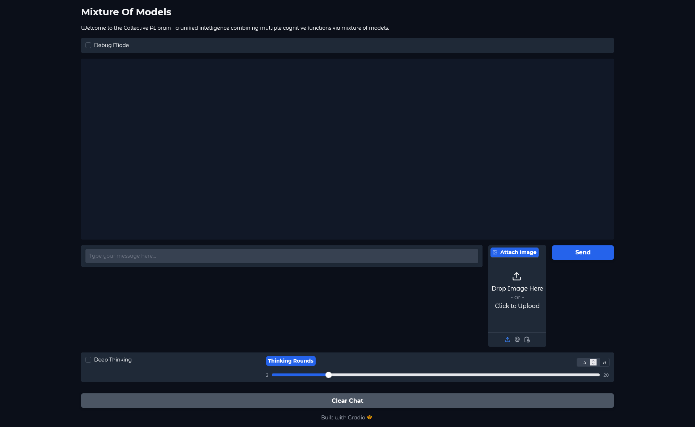
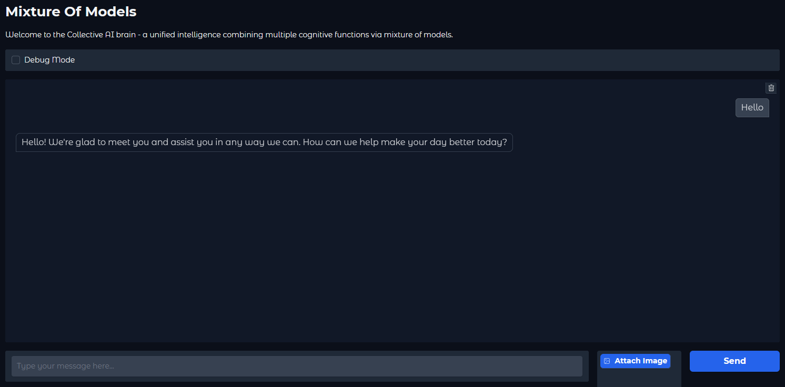
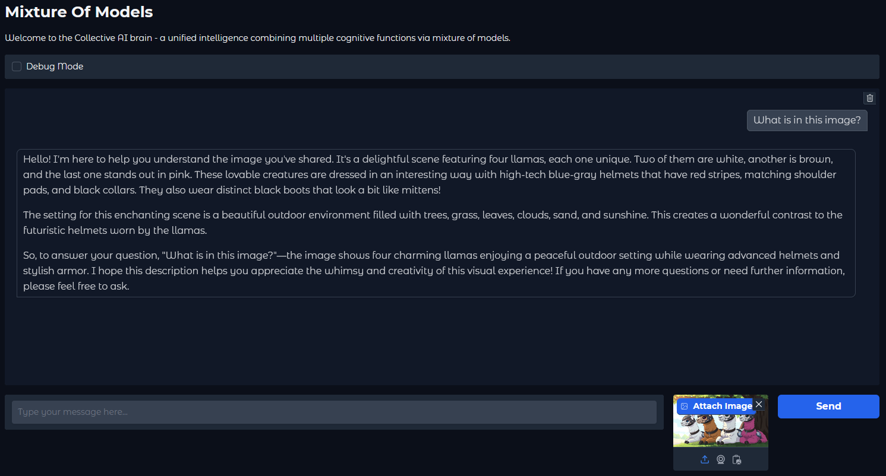

# Mixture of Models (MOM)
A collective thought experiment with a gradio interface, vision capabilities, and deep thought.

Welcome to the **Mixture of Models (MOM)** experiment - a collective AI brain that unifies multiple cognitive functions via a mixture of models. This project demonstrates how different AI models can work together, each contributing their unique perspective, to generate cohesive and intelligent responses.


## Table of Contents
- [Introduction](#introduction)
- [Features](#features)
- [Installation](#installation)
- [Usage](#usage)
- [Environment Variables](#environment-variables)
- [Extensions](#extensions)
- [DeepThinking Extension](#deepthinking-extension)
- [Contributing](#contributing)
- [License](#license)

## Introduction
Mixture of Models (MOM) leverages multiple AI models, each representing a different cognitive function or personality, to process user inputs collectively. By synthesizing the outputs of these models, the system provides a comprehensive and nuanced response that reflects a blend of perspectives.

## Features
- **Collective Intelligence**: Combines multiple AI models, each with unique characteristics, to generate richer responses.
- **Extension Support**: Easily extend the system's capabilities by adding custom extensions.
- **Environment Configuration**: Customize key parameters via environment variables.
- **Interactive Interface**: Provides a user-friendly interface powered by Gradio.
- **GPU Monitoring**: Monitors GPU temperature and cools down if necessary to prevent overheating. (Defaults to 75*C or 167*F. Temps are in C)






## Minimum System Requirements
- 32GB of system Ram (Not GPU Ram)
- A Modern CPU
- GPU (Not required) an RTX 2060 or greater will speed up inference
- 100GB free space (before installing all models)

## Recommended System Requirements
- 64GB of system ram
- A modern Nvidia GPU at least 16gb Ram
- NVME SSD or greater

## Installation
### Prerequisites
- Python 3.7 or higher
- [pip](https://pip.pypa.io/en/stable/installation/)
- [Git](https://git-scm.com/downloads)
- [NVIDIA GPU drivers](https://www.nvidia.com/Download/index.aspx) (if using GPU acceleration)
- [NVIDIA CUDA Toolkit](https://developer.nvidia.com/cuda-downloads) (if using GPU acceleration)
- [Ollama](https://ollama.com/) (or another compatible AI API)

### Steps
1. **Clone the Repository**

```bash
git clone https://github.com/talkquazi/MixtureOfModels.git
cd MixtureOfModels
```

2. **Install Dependencies**

```bash
pip install -r requirements.txt
```

3. **Configure Environment**

Create a `.env` file in the project root:
*By default one already is made that works for ollama running on the same machine*

```properties
OLLAMA_API_URL=http://localhost:11434/v1/
GRADIO_PORT=7860
GPU_TEMP_LIMIT=75
DEBUG_MODE=False
TOKEN_MODE=True
```

4. **Installing Models**

After installing ollama open a terminal and type in the following to install the default models from characters.json
You will need a minimum of 32gb of ram to run all of the models that are by default in characters.json. If you do not have that much system ram (Not GPU ram) then you can replace all the models with different models but expect varying results.

```bash
ollama pull llama3.2
ollama pull llama3.2-vision
ollama pull gemma2
ollama pull llama3.1
ollama pull qwen2.5
ollama pull mistral
ollama pull nemotron-mini
ollama pull granite3-moe
ollama pull mixtral
```

## Usage
1. **Start the Application**

```bash
python app.py
```

2. **Access the Interface**

- [Open your browser and navigate to `http://localhost:7860`](http://localhost:7860)
- The interface will display a chat window with options for:
- Text input
- Image upload
- Debug mode toggle
- Extension controls

3. **Features**

- **Multi-Model Processing**: Each query is processed by multiple AI models with different cognitive specialties
- **Image Analysis**: Support for image input with vision model processing
- **GPU Monitoring**: Automatic temperature monitoring and cooling periods
- **Debug Mode**: Toggle detailed processing information
- **Token Tracking**: Monitor token usage and processing metrics
- **Extension System**: Modular system for adding new capabilities

## Extensions
### DeepThinking Extension

The DeepThinking extension enables multi-round cognitive processing with voting mechanism:

- **Features**:
- Multiple thinking rounds
- Character voting system
- Configurable vote threshold
- Progress tracking per round
- Early stopping on consensus

- **Configuration**:
- Enable/disable via checkbox
- Adjust thinking rounds (2-20)
- Monitor progress in chat window
- Monitor internal thoughts on the command line with Debug enabled

### Creating New Extensions
1. Create a new directory under `extensions/`

2. Include required files:

```
extensions/
└── YourExtension/
  ├── extension.py
  ├── config.json
  └── requirements.txt (optional)
```

3. Implement the Extension class:

```python
from extensions import Extension
class YourExtension(Extension):
def init(self, collective_brain) -> None:
pass
def get_ui_components(self) -> Dict[str, Any]:
pass
async def pre_process(self, message: str, history: list) -> tuple:
pass
async def post_process(self, response: str, history: list) -> tuple:
pass
def get_extension_name(self) -> str:
return "YourExtension"
```

## Technical Details
### Architecture
- **Collective Brain**: Central coordinator managing multiple AI models
- **Cognitive Functions**: Individual models with specific expertise
- **Synthesizer**: Combines multiple model outputs
- **Extensions**: Modular system for additional processing
- **GPU Monitor**: Manages GPU temperature and cooling
- **Token Tracker**: Monitors and reports token usage (Not tokenizer based token use but custom token use)

### GPU Management
The system includes automatic GPU temperature monitoring:
- Configurable temperature limit (default 75°C)
- Automatic cooling periods when threshold exceeded
- Pre/post-inference temperature checks

### Performance Metrics
When TOKEN_MODE is enabled, the system tracks:
- Total processing time
- Token count per model
- Tokens per second
- Segment-by-segment analysis

## Troubleshooting
### Common Issues
1. **GPU Temperature Warnings**
- Ensure proper ventilation
- Adjust GPU_TEMP_LIMIT in .env
- Monitor system cooling

2. **Model Loading Errors**
- Verify Ollama installation
- Check model availability
- Ensure sufficient system resources

3. **Extension Issues**
- Check extension requirements
- Verify config.json format
- Enable debug mode for detailed logs

## Contributing
Contributions are welcome! Please:
1. Fork the repository
2. Create a feature branch
3. Submit a pull request

## License
This project is licensed under the MIT License - see the [LICENSE](LICENSE) file for details.
